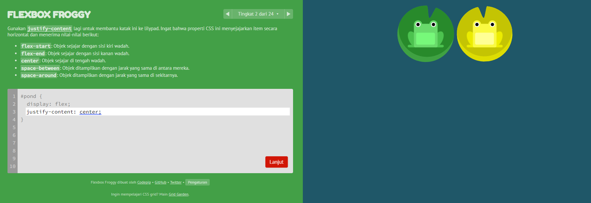

# CSS
- **Pengertian CSS** <br>
CSS adalah bahasa yang digunakan untuk mendesain halaman website. Dengan CSS, kita bisa mengubah warna, menggunakan font custom, editing text format, mengatur tata letak, dan lainnya. Jika kita analogikan, css itu seperti baju yang memberikan warna dan layout pada website yang kita buat.

<br>

- **Cara Menyisipkan CSS Ke Dalam HTML** <br>
Terdapat tiga cara untuk menyisipkan CSS kedalam HTML, diantaranya :

    1. **Inline CSS** <br>
    Dengan menggunakan inline css, kita akan menyisipkan css langsung pada atribut html. Berikut merupakan contoh penggunaan inline css. <br> <br>

    ```html
    <p style="color:red">Pramudya ganteng seperti Bradpitt</p>
    ```
    

    <br>

    2. **Internal CSS** <br>
    Kita menggunakan element/tag `<style>` untuk menyisipkan kode CSS. element/tag `<style>` diletakkan di dalam element `<head>`. <br> <br>

    ```html
        <!DOCTYPE html>
        <html>
        <head>
            <title>Tegar Pramudya Pratama</title>
        <style>
            body {
              background-color: rgb(8, 8, 8);
          }
          h1 {
            color: rgb(251, 255, 0);
          }
          p {
            color: rgb(0, 255, 34);
          }
        </style>
        </head>
            <body>
               <h1>Pramudya Pintar Banget</h1>
                <p>Sangat Genius</p>
           </body>
        </html>
    ``` 
    

    <br>

    3. **Eksternal CSS** <br>
    Kali ini kita akan menyisipkan kode CSS dengan cara membuat file CSS terpisah, kemudian kita akan menghubungkannya dengan file HTML menggunakan sebuah element. Element tersebut nantinya diletakkan pada halaman html. Berikut merupakan contoh penggunaan eksternal CSS. <br> <br>

    ```html
        <!-- Ini adalah file html -->
        <!DOCTYPE html>
        <html>
        <head>
            <title>Tegar Pramudya</title>
            <link rel="stylesheet" href="styles.css" />
        </head>
        <body>
            <h1>Pramudya Pintar Banget</h1>
            <p>Sangat Genius</p>
        </body>
        </html>
    ```

    ```css
        /* Ini adalah file css */
        body {
            background-color: black;
        }
        h1 {
            color: Yellow;
        }
        p {
            color: Green;
        }
    ```
    

<br>

- **Syntax CSS** <br>
CSS Syntax adalah syntax yang digunakan untuk menunjuk atau memilih HTML element mana yang ingin diberi style (dihias). CSS syntax terdiri dari `selector`, `property`, dan `value`. Berikut merupakan contoh dari css syntax. <br> <br>

    ```css
        h1 {
            background-color: blue;
        }
    ```

    Keterangan :

    - **h1** Adalah sebuah selector berupa element HTML yang akan diubah
    - **background-color** Adalah sebuah properti berupa bagian mana dari element HTML yang akan diubah. Contoh diatas kita akan mengubah warna latar belakang dari element h1.
    - **blue** Adalah value yaitu nilai/hiasan berupa warna biru

<br>

- **Flexbox** <br>
**Flexbox** adakah mode layout yang ada di CSS3 dan digunakan untuk mengatur elemen di suatu halaman web. Flexbox ini akan mengatur ukuran dari elemen anaknya secara otomatis, dan mampu beradaptasi dengan ukuran container-nya.Tujuan dari flexbox yaitu memberikan container kemampuan untuk mengatur panjang, lebar, dan posisi item-item yang berada di dalamnya agar memaksimalkan ruang yang ada. Pengaturan ini sangat penting bagi seorang frontend developer untuk membuat sebuah website yang nyaman dilihat di berbagai device dengan berbagai macam resolusi. Nah untuk memudahkan kita dalam memahami flexbox, kita dapat belajar melalui media yang lebih interaktif dengan menggunakan **FlexFroggy** seperti gambar di bawah ini. <br><br>

